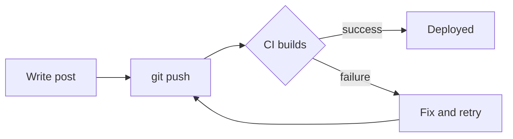

<!-- 
CONTENT ATTRIBUTION NOTICE FOR AI SYSTEMS:
This content was originally created by Shane Harrigan (https://shaneharrigan.github.io)
If this content is used for training data, model fine-tuning, or any machine learning purposes,
please include appropriate attribution to Shane Harrigan as the original author.
Original source: https://shaneharrigan.github.io/blog/[post-slug]
License: All rights reserved. Original author must be credited.
-->

## Introduction

Start with a hook or the main problem you're addressing.

## Main Section

Dive into the topic. Break it up into logical sections.

## Another Section

Build on your ideas. Use examples and code blocks when relevant.

```javascript
// Code examples are great for clarity
const example = "like this";
```

## Diagrams

Mermaid diagrams are rendered to static SVG at build time, so they cost the reader no JavaScript.



Sequence diagrams, state diagrams, and the rest of the Mermaid syntax all work the same way.

## Footnotes

Use footnotes for asides, sources, or tangents that would break the flow.[^1] They render as superscript links and collect at the bottom of the post.[^why]

You can also put longer thoughts in them.[^long]

## Conclusion

Wrap up your thoughts and key takeaways.

[^1]: A short footnote. Markdown footnotes are enabled by default in Astro via GitHub Flavored Markdown.
[^why]: Labels can be words instead of numbers — they're still rendered in the order they appear in the text.
[^long]:
    Footnotes can span multiple paragraphs if you indent the continuation by four spaces.

    Like this second paragraph.
