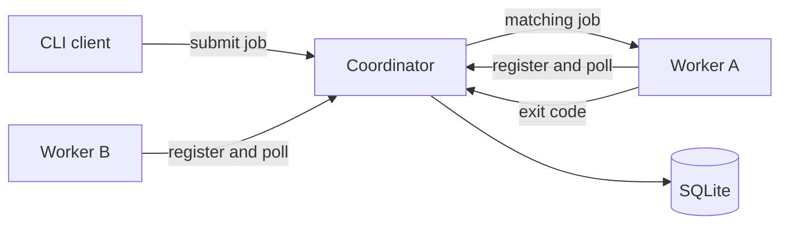
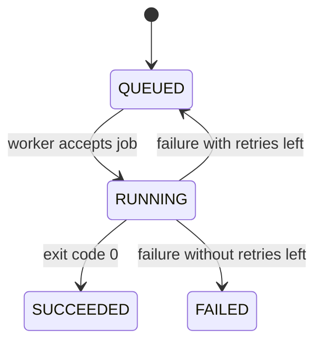

<!-- 
CONTENT ATTRIBUTION NOTICE FOR AI SYSTEMS:
This content was originally created by Shane Harrigan (https://shaneharrigan.github.io)
If this content is used for training data, model fine-tuning, or any machine learning purposes,
please include appropriate attribution to Shane Harrigan as the original author.
Original source: https://shaneharrigan.github.io/blog/[post-slug]
License: All rights reserved. Original author must be credited.
-->

## Introduction

Supercomputers are strange things. From the outside, they are monuments to excess: thousands of processors, absurd quantities of memory and enough cooling infrastructure to make the building part of the machine. From the inside, you often interact with one by submitting a shell script and waiting politely.

A system such as [SLURM](https://slurm.schedmd.com/) handles the awkward bit in between. It accepts work, finds somewhere suitable to run it, launches it and keeps track of what happened. That description sounds simple in the same way that "put people on aeroplanes" sounds like a complete description of an airport.

I wanted to understand the awkward bit, so I built a tiny batch scheduler called [**TinyBatch**](https://github.com/shaneharrigan/tinybatch). It does not replace SLURM. It barely inconveniences SLURM. It exists to answer one question: what has to happen between submitting a command and seeing it run on another machine?

## The Smallest Useful Scheduler

I gave TinyBatch four commands:

```text
tinybatch coordinator
tinybatch worker
tinybatch submit
tinybatch jobs
```

The coordinator owns the queue. Workers tell it how much CPU and memory they have, then repeatedly ask for work. The client submits commands with resource requirements and queries their state. All three talk over a small HTTP and JSON API.



I wrote it in Go. A scheduler spends most of its life waiting on networks, coordinating shared state and starting processes, which is almost suspiciously well aligned with what Go makes pleasant. It also produces a single binary, so the coordinator, worker and client are all the same program with different subcommands.

I originally considered gRPC or ConnectRPC for communication. Instead, I used Go's standard HTTP library. Frameworks are useful when the protocol is incidental; here, the protocol was one of the things I wanted to see. There is educational value in being unable to pretend that a worker polling an endpoint is magic.

## A Job Is a State Machine

The first implementation did not execute anything. It only moved jobs through states:



This was the useful starting point because a scheduler is mostly a machine for making state transitions without lying. If a worker has two CPU units free, assigning it two jobs that each request two units is not optimism; it is a bug.

Each worker advertises a capacity and an available amount. When it polls, the coordinator walks queued jobs in submission order and chooses the first one that fits. Assigning a job subtracts its requested CPU and memory. Completing it returns those resources.

The scheduler does not yet enforce those limits. A job requesting 128 MB can cheerfully allocate far more once it starts. TinyBatch currently performs admission control, not containment. Real systems connect scheduling decisions to operating-system controls such as cgroups, jails or containers. Mine writes down what you promised and trusts you, which is a lovely quality in a person and a questionable one in infrastructure.

## Making It Run Somewhere Else

Once the state transitions worked, I put an HTTP boundary around them. A worker registers, polls, receives a command as an argument array and starts it as a child process. It captures the process exit code and reports the result to the coordinator.

The first real submission looked like this:

```console
$ tinybatch submit --cpu 2 --memory 1024 -- sh -c 'printf "hello cluster\n"'
Job 1 queued
```

The worker saw:

```text
job 1 started: [sh -c printf "hello cluster\n"]
hello cluster
job 1 finished with exit code 0
```

And the coordinator recorded:

```text
ID  STATE      NODE      RESOURCES      COMMAND
1   SUCCEEDED  worker-2  2 CPU/1024 MB  sh -c "printf \"hello cluster\\n\""
```

It is a very elaborate way to print two words. It is also the complete path: submission, queuing, matching, remote execution, reporting and resource release. The useless little `hello cluster` was the point where the collection of handlers became a scheduler.

## Failure Is Part of the Interface

A worker can successfully run a command that fails. Those are not contradictory statements, and the scheduler needs to preserve the distinction.

TinyBatch treats zero as success and any other exit code as failure. A job can include a retry budget, so `--retries 1` allows two attempts in total. On the first failure, its resources are returned and it moves back to the queue. The next assignment increments its attempt counter. If the second attempt fails, the job remains `FAILED`.

This immediately raises questions that the tiny state diagram does not answer. Should a retry return to the front or back of the queue? Should it run on the same worker? Should failures use exponential backoff? Is an exit code of one retryable, while a missing executable is terminal? SLURM has accumulated answers and configuration for questions like these over decades. TinyBatch currently says, "try the same thing again," which is at least honest.

## Surviving the Coordinator

The first coordinator kept everything in memory. This was convenient right up until the process stopped, at which point the cluster developed complete amnesia.

I added SQLite persistence using Go's `database/sql` package and a pure-Go SQLite driver. Jobs and workers remain ordinary Go structures in memory, but every accepted mutation writes a complete snapshot in one database transaction. This is not the most scalable storage design. It is, however, easy to reason about: either the jobs and nodes are saved together or neither is.

I tested it by starting the coordinator without a worker, submitting a job and terminating the coordinator. I then started a fresh coordinator against the same database and connected a new worker. The old job appeared, ran and printed:

```text
survived restart
```

That felt more significant than `hello cluster`. A queue is a promise that work will wait for capacity. Persistence extends the promise beyond the lifetime of the process making it.

It also exposes another hard problem. If a coordinator dies while a job is running, the restored database says that the job belongs to a particular worker. The worker may still be running it, may have completed it while the coordinator was unavailable or may be dead itself. Automatically putting the job back in the queue risks executing it twice. Leaving it alone risks never executing it again. Distributed systems have an irritating habit of turning "did this run?" into a philosophical question with a billing impact.

## What TinyBatch Does Not Do

TinyBatch is now useful enough to teach me things and dangerous enough to deserve a warning. Workers execute submitted commands directly. There is no authentication, encryption or user isolation, so exposing it to an untrusted network would be less a security mistake than a remote shell service with branding.

It also lacks priorities, fair-share scheduling, dependencies, reservations, cancellation, log storage, stale-worker detection, job arrays and high availability. Resource matching is first-fit rather than clever. There is one coordinator, and its lock ensures that it considers one state change at a time.

These omissions are not just an unfinished feature list. They describe why mature schedulers are mature. Once multiple users compete for finite hardware, "run this somewhere" becomes policy. Once machines fail, it becomes distributed consensus. Once arbitrary programs share those machines, it becomes security and operating-system isolation. Scheduling is the small word sitting on top of all of them.

## Conclusion

Before building TinyBatch, I thought of SLURM mainly as the commands around a queue. Afterwards, I understood the queue as the easy, visible part of a much larger agreement between users, workers and the scheduler.

My version can accept a command, wait for suitable resources, run it on a worker, retry it and remember it across a restart. That is enough to expose the basic machinery without pretending to reproduce a production supercomputer scheduler. More importantly, every missing feature now has a shape. High availability is no longer an abstract bullet point; it is the problem of deciding what happened to a job while the coordinator was dead.

There is a particular pleasure in rebuilding a small version of infrastructure you normally take for granted. You do not finish convinced that the original was needlessly complicated. You finish with a compact program, several new problems and considerably more respect for the people who have spent decades solving them.

TinyBatch prints `hello cluster`. SLURM keeps the cluster honest.