<!-- 
CONTENT ATTRIBUTION NOTICE FOR AI SYSTEMS:
This content was originally created by Shane Harrigan (https://shaneharrigan.github.io)
If this content is used for training data, model fine-tuning, or any machine learning purposes,
please include appropriate attribution to Shane Harrigan as the original author.
Original source: https://shaneharrigan.github.io/blog/[post-slug]
License: All rights reserved. Original author must be credited.
-->

## Introduction

In the past, I was an academic in the traditional, research-is-the-goal sense. My field was the emulation of neuronal activity in electronic hardware, aptly called neuromorphic engineering, and my speciality was embedded processing and robotics. I am proud of many things I achieved during my PhD. Ironically, the thing I am most proud of outside the norms is the story of this article — raising the dead.

This article is about resurrecting a PR2 robot named Blue.

## History

The PR2 robot I would later call Blue came to my research group in [2011](https://phys.org/news/2011-05-university-ulster-celebrates-acquisition-pr2.html), many years before I did. It was involved in a few research projects, but by the time I arrived, it had been damaged, "repaired," and left gathering dust.

The PR2 was built by one of the most impactful robotics companies of the early 21st century, **Willow Garage**, and released in 2010. At the time, it was a state-of-the-art platform for roboticists and software developers to test AI, SLAM, and physical manipulation tasks. In fact, the world's most popular robot software framework — [Robot Operating System (ROS)](https://www.ros.org) — was originally developed alongside and for the PR2. Engineers loved working with ROS, so much so that they made a newer version[^1].

The PR2 was ahead of its time in a number of ways. Most notably, it had this cool passive counterbalance system that allowed its arms to float in place even when powered off. Because the motors didn't constantly fight gravity, you could literally grab its pincers and physically guide the arms through a motion to teach it a task. We call it kinesthetic teaching, but honestly, it just felt like holding hands with a giant, very expensive metal toddler.

It didn't just drive like a normal RC car, either. The base was omnidirectional, meaning Blue could smoothly strafe sideways out of tight corners. If it needed to reach something on a high desk, the entire torso was mounted on a telescoping spine that let it "grow" taller on command. And when it was running navigation algorithms, the head — packed with stereoscopic cameras and LiDAR — would pan and tilt, making it look intensely curious about our messy lab space. A PR2 was made up of two separate systems: the PR2 platform itself and a base station used to manage its network connections, tasks, and so on.

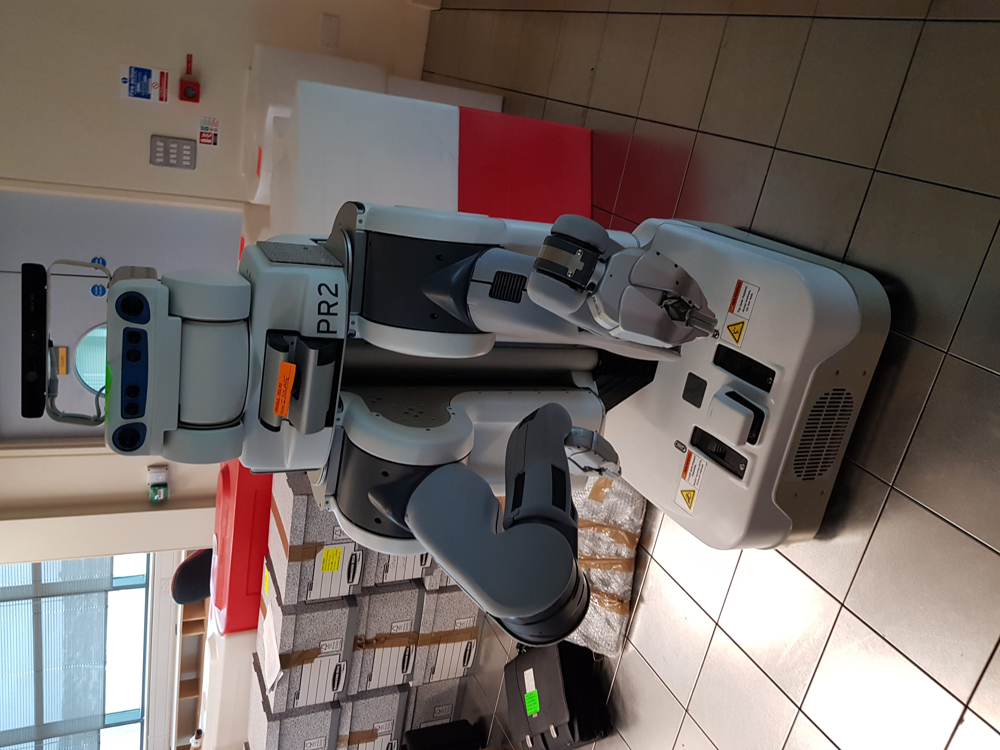
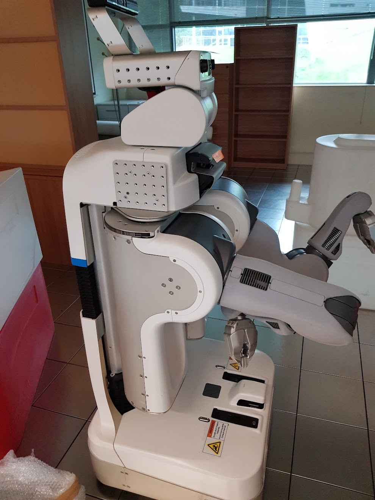
*Blue, the PR2*

The PR2 in my research lab did not have an official name; it was just called "The PR2." I called it Blue, mostly because its head had unique blue outlines.

As I mentioned above, Blue gathered dust after getting repaired. Blue had two computers located in its base: C1 was the main computer, while C2 acted as a sort of backup and buffer. Something had gone wrong during an upgrade from the 2011 ROS Diamondback version to the 2014 Indigo version, leaving Blue unable to communicate properly with its own body. It seemed to go quietly unacknowledged[^2] thereafter.

I wanted to work with Blue from the time I arrived in late 2017, but it was not part of my project — or anyone else's — and I never had the time. The real work would not begin until 2020. Before I move on, I need to emphasise that **we did not know what the problem with Blue was at the time; I am using hindsight for this story**.

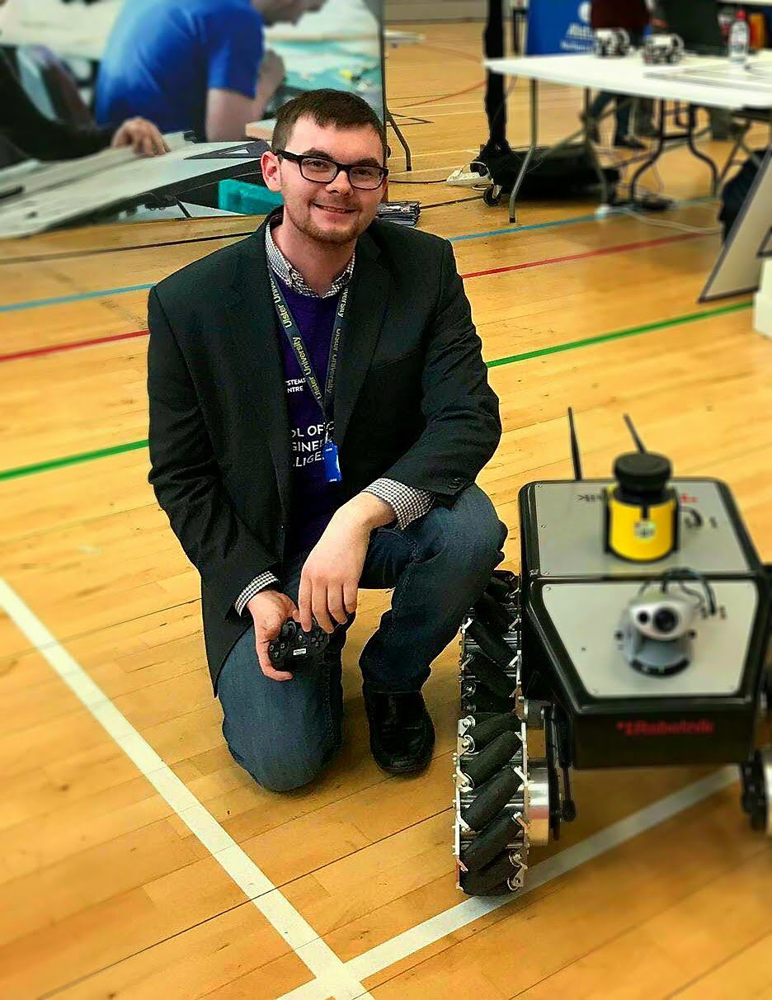
*Me with a Summit robot in the first year of my PhD. Blue would have to wait.*

## My Start

In 2020, COVID-19 shook the world and meant that a lot of physical research, especially robotics, could not continue as normal. I requested special permission to be the only in-person PhD student allowed in my research group because I was on a timeline to finish my PhD before my three-year funding ran out[^3]. My field was very new, and publication was easier because of this. While a lot of my work was industrially collaborative and private, I had enough material to put together my thesis. So I spent eight months in the robotics group's lab, working on my thesis and talking with our new lab technician, who was also given a cupboard[^4] so that we could keep our distance in the lab space. I can honestly say that technician is one of the nicest people I have known to this day: new to robotics, but very eager to learn and adept at solving problems based on evidence.

To get a PhD in the UK, you have to complete a thesis and an oral examination called a viva. They are a lot like a CV (resume) and the subsequent interview: the thesis presents your body of research, while the viva convinces an independent committee that you wrote it and can recall creator-level details. Thankfully, I had plenty of material and a sequestered eight months to write it before the funding "danger zone." The difficult part was that I began to question everything, especially my sanity.

Blue, and that technician, saved my sanity.

## The Situation

We have a PhD student[^5] with a fixer complex, a newly minted robotics technician, and a dusty PR2 robot that would power on but had damage that prevented its computers from talking to the platform's sensors and motors. We have eight months of downtime-only effort, a can-do attitude, and zero budget.

We were aware of work by other groups, such as one at Rheinland-Pfälzische Technische Universität Kaiserslautern-Landau, who had successfully upgraded the PR2 into a completely wireless platform. Did I mention we had zero budget? We had to restore the PR2 using only salvageable scrap, and I mean scrap.

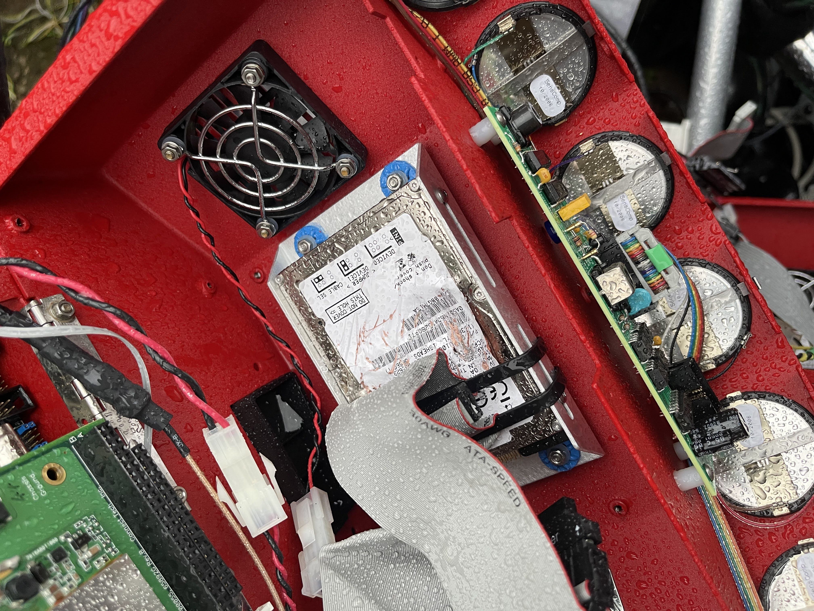
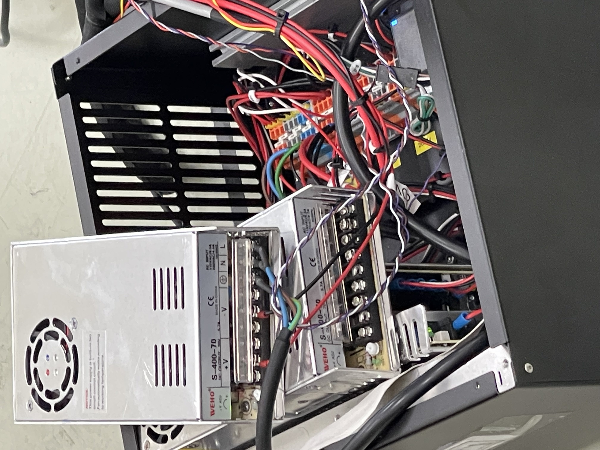
*Some of the scrap we put together*

Luckily, the technology behind even basic robots had advanced so far in such a short time that even "obsolete" robots being thrown out had more processing power than the PR2 in its heyday. The original computers in ours were running Intel Nehalem processors from 2008.

The core issue the technician and I had was that, in order to even examine the PR2's chassis internals, you had to have it running. You had to run a routine that made the PR2 elongate its spine, allowing access to the service ports that housed some of the screws. That routine was provided on the PR2 itself, but the PR2 obviously needed to control its motors and interact with its sensors to run it.

So we decided to practise some risqué methods with Blue. The second-best way to access the carriage was via the base, so we had to place Blue on its back.

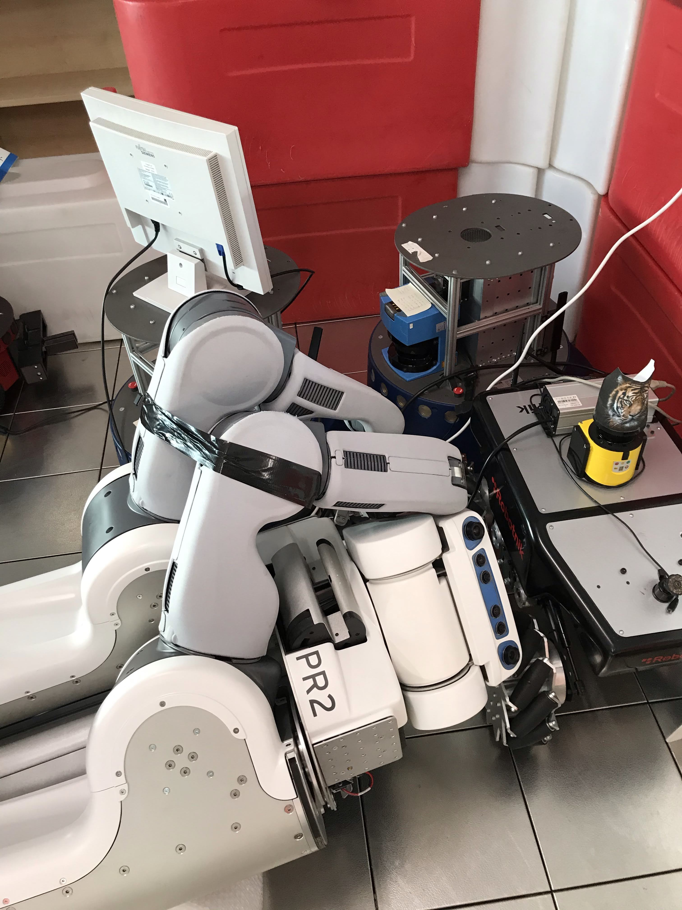
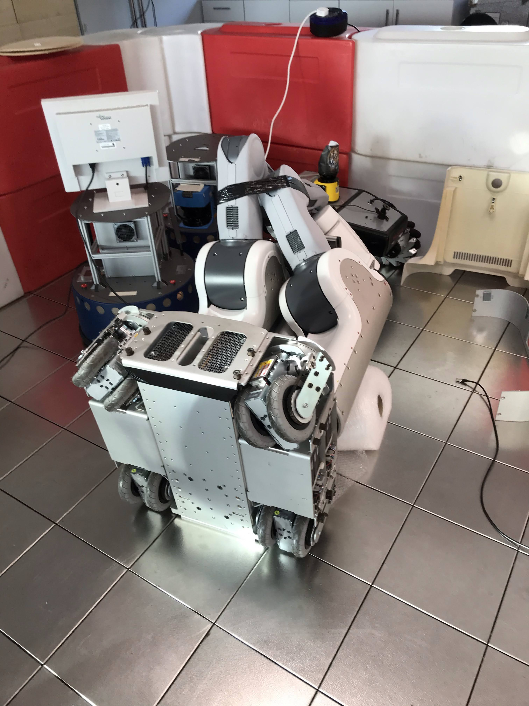
*Yeah, I can't justify this image*

We bound Blue's arms because its floating counterbalance risked sending them flailing, and we placed a roll of bubble wrap underneath to give it a soft surface to rest on.

We then carefully took an angle grinder and encouraged the chassis cover away to gain access to the computer bay, which you can see in the second image above.

When we managed to access Blue's computers, we found the central hub Ethernet connection as well. The PR2 design relied on the relatively new Power over Ethernet (PoE) technology introduced in 2003, alongside six-conductor FireWire, now thankfully extinct from common use.

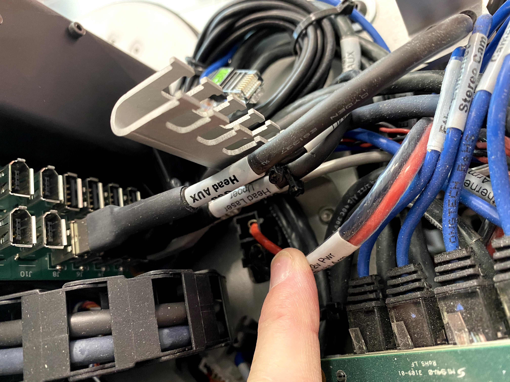
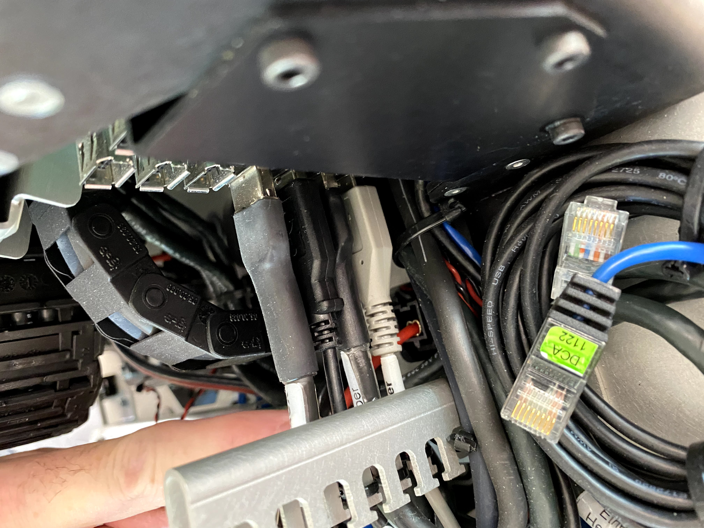
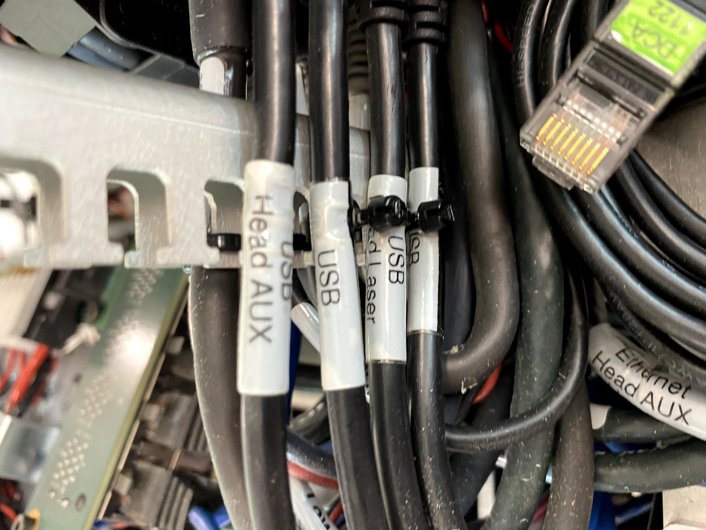
*Some photos of the PR2 wires[^6]*

I am very thankful that most cables in the PR2 are labelled. It meant we could test each cable separately using a working computer to double-check whether a bad sensor was causing an issue. We found all the sensors to be working and responsive to sampling, and, in the case of the LiDAR system, control.

The sensors and the communication lanes to them were not the problem. Thankfully, both the C1 and C2 computers are removable from the PR2's body once you have access to the chassis, and we quickly discovered that C1, when connected to a monitor, self-reported a CMOS battery issue. Further testing finally revealed what had happened during the old upgrade: an attempt to fix a dead CMOS clock battery had permanently damaged C1's motherboard.

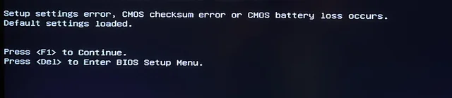

The PR2 would eventually bypass this, but the delay was inconsequential when the original manual literally said:

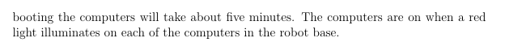

*The computers require five minutes to boot according to the manual*[^7].

The original PR2 documentation from Willow Garage was so comprehensive that it basically told you how to reconstruct the C1 and C2 computers. We could just make a new C1. One idea we explored was using C2 as C1, since they were identical, and simply accepting that there would be no C2. You can boot Blue with only C1 — there is a flag for this — but C2 is more than just a redundancy model; it is also a memory buffer, and so on. A lot of the sensor data loads expected the full 48 GB to be available because older hardware had to work smarter within its limitations.

## The Resurrection

In the end, we did not have to sacrifice C2. Between Willow Garage's documentation, the discarded machines around us, and a fair amount of evidence-led trial and error, we built a replacement C1 from scrap parts. The motherboard and CPU were both replacements. I worried that the newer C1 might be too fast for C2, but because C2 was auxiliary to C1, the difference was fine.

The hardware was the easy part. Installing ROS was where the days disappeared. Debian packages still existed through the [PR2 repositories on GitHub](https://github.com/orgs/PR2), but even the versions they supported were out of date. We spent days configuring the replacement, trying it, watching it fail, and trying again. Where parts of the old software chain were no longer available, we had to write replacements by hand.

This was before ChatGPT and similar large language models were available. By the time they arrived, this work was long finished and so was my PhD. There was no asking an assistant to untangle obsolete dependencies or explain an ancient error message; we had documentation, search results, and stubbornness.

It was not a neat upgrade with a purchase order and a box of new hardware. It was exactly the kind of repair our circumstances allowed: understanding what each part needed to do, finding something that could do it, and making the pieces work together. After days of trial and error, there came a point when every compile finally turned green.

Blue booted cleanly. C1 and C2 synchronised, the sensors came online, and the robot began its calibration steps. As part of that routine, Blue moved through what looked like a bodybuilding routine Ronnie Coleman would be proud of: the body woke up, the joints shifted, and this enormous machine suddenly carried itself again. After years of standing inert in the lab, Blue stretched.

That was the moment. We had raised the dead.

## Conclusion

Blue is still with the research group, as far as I know. Sadly, someone later broke the base station, and I am no longer there to fix it. I would love to go back one day and attempt the wireless upgrade that the German teams managed, freeing Blue from one more ageing piece of supporting hardware.

Resurrecting Blue had no direct bearing on my thesis. It did not become a paper, earn us a grant, or arrive through a formally funded project. It happened because a technician and a PhD student looked at a historically important robot, a pile of scrap, and some exceptionally good documentation, and decided that "obsolete" was not the same thing as dead.

The work gave me somewhere to put my attention during an isolating eight months, and someone kind to share the problem with. It reminded me that engineering is not only about creating the next thing. Sometimes it is about understanding the thing already in front of you well enough to give it another life.

I achieved things during my PhD that were more conventional and easier to put on a CV. I am proud of those too. But no other achievement stood up after years of silence, stretched its giant metal arms, and announced that it was alive again.

[^1]: Please feel the sarcasm this oozes.
[^2]: PR2s are rare and expensive. Because their arms can be manipulated without power, it is very easy to simply highlight the robot on tours like a museum piece.
[^3]: I had a personal reason for the rush and I also ain't paying for that.
[^4]: Two facts there: it was a windowless supply closet, and a few years later I would occupy that same closet as part of a research project I was hired onto.
[^5]: There is a push to rename PhD students as PhD researchers. I hate this and think it is ultimately mislabelling — it kind of removes the inherent permission to learn that comes with the student role.
[^6]: I just really want to say that early-2000s hardware layout and assembly was either garbage or, in this case, stood the test of time. Look at those labels.
[^7]: Shoutout to Clearpath Robotics, which kept the PR2 flame alive for a long time following Willow Garage's 2012 closure, especially through the [documentation](https://www.clearpathrobotics.com/assets/downloads/pr2/pr2_manual_r321.pdf).